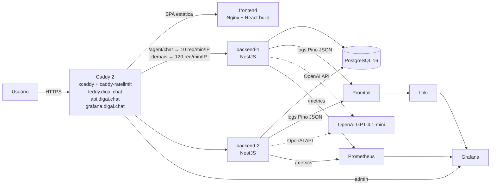
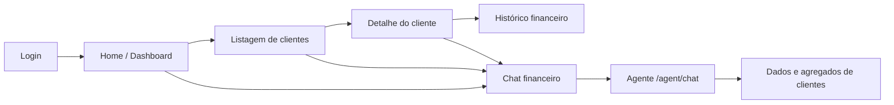
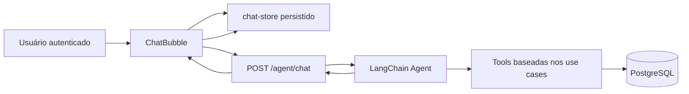
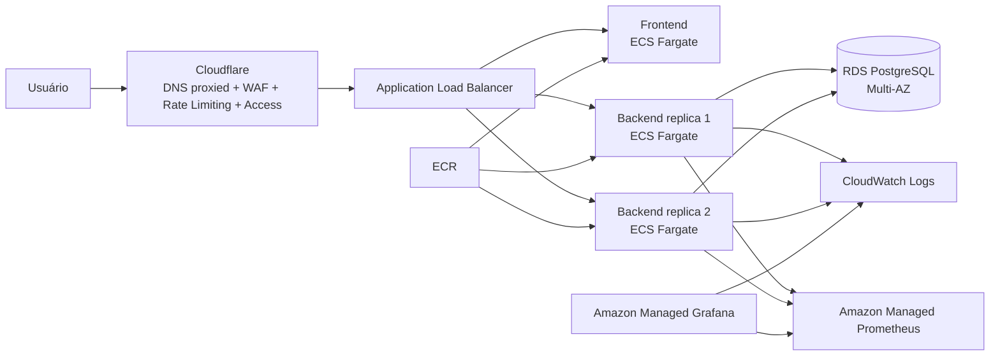

# Teddy Open Finance

Monorepo Nx com um MVP full-stack de gestão de clientes para o desafio **Tech Lead Pleno** da Teddy Open Finance. Inclui autenticação JWT, CRUD de clientes com histórico financeiro, um agente conversacional em LangChain + OpenAI (`/agent/chat`) e pipeline completa de CI/CD com observabilidade (Prometheus, Loki, Grafana).

- Produção (front): https://teddy.digai.chat
- Produção (API): https://api.digai.chat (Swagger em `/docs`)
- Produção (Grafana): https://grafana.digai.chat

---

## Sumário

- [Stack](#stack)
- [Documentação do repositório](#documentação-do-repositório)
- [Estrutura do monorepo](#estrutura-do-monorepo)
- [Visão arquitetural](#visão-arquitetural)
- [Capacidades entregues](#capacidades-entregues)
- [Pré-requisitos](#pré-requisitos)
- [Configuração — arquivos `.env`](#configuração--arquivos-env)
  - [Back-end](#back-end-appsback-endenv)
  - [Front-end](#front-end-appsfront-endenv)
- [Rodando localmente](#rodando-localmente)
  - [Modo dev com Nx (recomendado no dia a dia)](#modo-dev-com-nx-recomendado-no-dia-a-dia)
  - [Stack completa via Docker Compose](#stack-completa-via-docker-compose)
- [Comandos Nx mais usados](#comandos-nx-mais-usados)
- [Banco de dados e migrations](#banco-de-dados-e-migrations)
- [Qualidade, testes e hooks de git](#qualidade-testes-e-hooks-de-git)
- [Chat financeiro no app](#chat-financeiro-no-app)
- [Agente de chat (`/agent/chat`)](#agente-de-chat-agentchat)
- [Observabilidade local](#observabilidade-local)
- [Deploy em produção](#deploy-em-produção)
- [Troubleshooting](#troubleshooting)
- [Fluxo de trabalho (Git Flow)](#fluxo-de-trabalho-git-flow)

---

## Stack

| Camada          | Tecnologias                                                                 |
| --------------- | --------------------------------------------------------------------------- |
| Front-end       | React 19, Vite, TypeScript, Tailwind CSS, React Query, Zustand, Router      |
| Back-end        | NestJS 11, TypeORM 0.3, PostgreSQL 16, Passport JWT, Pino, Swagger          |
| Agente          | LangChain 1.3, `@langchain/langgraph`, OpenAI (GPT-4.1-mini), PostgresSaver |
| Monorepo        | Nx 20, `@nx/docker`, cache de build e inferência de targets                 |
| Contratos       | Library compartilhada `@teddy-open-finance/contracts`                       |
| Observabilidade | Prometheus (`prom-client`), Loki + Promtail, Grafana                        |
| Edge / TLS      | Caddy 2 (build customizada com `caddy-ratelimit`)                           |
| CI / CD         | GitHub Actions, GHCR (Docker images), VPS Linux                             |

## Documentação do repositório

Documentos principais já existentes no projeto:

- [README do back-end](./apps/back-end/README.md)
- [README do front-end](./apps/front-end/README.md)
- [Compose de produção](./deploy/production/docker-compose.yml)
- [Script de deploy](./deploy/production/scripts/deploy.sh)
- [Caddyfile de produção](./deploy/production/Caddyfile)
- [Prometheus de produção](./deploy/production/prometheus.yml)
- [Loki de produção](./deploy/production/loki-config.yml)
- [Dashboards do Grafana](./apps/back-end/observability/grafana/dashboards/)

Arquivos úteis para leitura rápida:

- [Exemplo de env do back-end](./apps/back-end/.env.example)
- [Exemplo de env do front-end](./apps/front-end/.env.example)
- [Exemplo de env da stack de produção](./deploy/production/.env.example)

## Estrutura do monorepo

```text
apps/
  back-end/          API NestJS (Clean Architecture por módulo)
  back-end-e2e/      E2E da API (Jest + supertest)
  front-end/         SPA React
  front-end-e2e/     E2E do front (Cypress)

libs/
  shared/contracts/  Tipos e DTOs compartilhados entre back e front

deploy/
  production/        Dockerfile.caddy, docker-compose.yml, Caddyfile, grafana/, prometheus.yml

docker-compose.yml   Stack local completa (API, front, Postgres, observabilidade)
```

Convenção de módulos do back-end (Clean Architecture):

```text
apps/back-end/src/modules/<feature>/
  domain/            Entidades e interfaces de repositório
  application/       Use cases (1 classe por caso de uso)
  infrastructure/    Implementações concretas (TypeORM, LangChain, etc.)
  api/               Controllers + DTOs de entrada/saída
```

## Visão arquitetural

Alto nível da solução em produção (Caddy termina TLS e distribui tráfego; duas réplicas do back atrás dele; observabilidade na mesma rede Docker):



### Decisões arquiteturais principais

| Decisão                                                             | Por quê                                                                                                             |
| ------------------------------------------------------------------- | ------------------------------------------------------------------------------------------------------------------- |
| **Clean Architecture por módulo no back**                           | Isola regras de negócio em `domain/application`, permite trocar infra sem quebrar use cases (ex.: testes com mock). |
| **Contratos compartilhados em `libs/shared/contracts`**             | Elimina divergência de tipos entre front e back; DTOs e enums vivem em uma fonte única de verdade.                  |
| **Refresh token em cookie `HttpOnly` + access token só em memória** | Minimiza exposição XSS; access token nunca toca `localStorage`. Boot chama `/auth/refresh` pra reidratar sessão.    |
| **Agente reutilizando use cases como Tools**                        | Zero duplicação de regra de negócio. O agente é uma "camada de apresentação" sobre a API.                           |
| **Memória do agente via `PostgresSaver` com `thread_id = userId`**  | Continuidade de conversa entre sessões do usuário, sem lógica custom de histórico.                                  |
| **Rate limit de `/agent/chat` no Caddy (não no app)**               | Bloqueia antes de bater no Node, protege quota OpenAI. Implementado com `xcaddy --with mholt/caddy-ratelimit`.      |
| **Observabilidade provisionada como código**                        | Datasources e dashboards do Grafana versionados; paridade dev/prod.                                                 |
| **Chat no front com Zustand `persist` + `clearMessages` no logout** | Histórico sobrevive refresh da página; sessão do usuário seguinte começa limpa.                                     |
| **Duas réplicas do back atrás do Caddy**                            | Tolerância a restart/deploy sem downtime; round-robin com healthcheck em `/healthz`.                                |

## Capacidades entregues

O projeto já cobre estes fluxos principais:

- autenticação com `accessToken` + `refreshToken`, incluindo refresh por cookie `HttpOnly`
- CRUD completo de clientes com listagem paginada
- dashboard Home com métricas e rankings
- página de detalhes do cliente com contador de acessos
- histórico financeiro de salário e valuation
- chat financeiro em `/agent/chat`
- observabilidade com Prometheus, Loki, Promtail e Grafana
- deploy automatizado em produção com GitHub Actions + GHCR + VPS

### O que foi pensado na solução

O desafio foi tratado como um produto operacional, não apenas como um CRUD. A aplicação precisava cobrir três necessidades ao mesmo tempo:

- operação diária de clientes com leitura rápida de métricas
- rastreabilidade de alterações financeiras relevantes
- uma forma simples de explorar os dados por linguagem natural

Por isso, a solução foi dividida em três pilares:

- **gestão transacional**: autenticação, CRUD, paginação, seleção e detalhe do cliente
- **camada analítica**: dashboard Home, rankings e histórico financeiro
- **camada assistiva**: chat financeiro reaproveitando os mesmos casos de uso da API

Essa escolha reduz duplicação de regra de negócio e deixa o produto mais coerente: o dado que aparece no dashboard, na página de detalhe e no chat parte da mesma base.

Principais rotas expostas pela API:

| Grupo   | Rotas principais                                                                                                                       |
| ------- | -------------------------------------------------------------------------------------------------------------------------------------- |
| Auth    | `POST /auth/register`, `POST /auth/login`, `POST /auth/refresh`, `POST /auth/logout`                                                   |
| Clients | `POST /clients`, `GET /clients`, `GET /clients/:id`, `PATCH /clients/:id`, `DELETE /clients/:id`, `GET /clients/financial-history/:id` |
| Agent   | `POST /agent/chat`                                                                                                                     |
| Infra   | `GET /healthz`, `GET /metrics`, `GET /docs`                                                                                            |

Arquitetura por aplicação:

- Back-end: NestJS com Clean Architecture por módulo. O ponto de entrada é [apps/back-end/src/app.module.ts](./apps/back-end/src/app.module.ts) e a estrutura detalhada está no [README do back-end](./apps/back-end/README.md).
- Front-end: SPA React com feature folders, Zustand e React Query. O ponto de entrada visual é [apps/front-end/src/app/app.tsx](./apps/front-end/src/app/app.tsx) e a visão geral está no [README do front-end](./apps/front-end/README.md).
- Contratos compartilhados: [libs/shared/contracts/](./libs/shared/contracts/), usados para manter o wire format consistente entre front e back.

### Fluxo funcional do produto



## Pré-requisitos

- **Node.js 24+** (recomendado via `nvm` ou `fnm`)
- **npm 10+**
- **Docker + Docker Compose** (para Postgres e/ou stack completa)
- **OpenAI API Key** (opcional — necessária apenas para testar `/agent/chat`)

## Configuração — arquivos `.env`

Copie os exemplos antes de rodar qualquer coisa:

```bash
cp apps/back-end/.env.example apps/back-end/.env
cp apps/front-end/.env.example apps/front-end/.env
```

Os `.env` são carregados automaticamente (Nest via `@nestjs/config`; Vite nativamente). A classe `EnvironmentVariables` em [apps/back-end/src/infrastructure/config/env/env.validation.ts](apps/back-end/src/infrastructure/config/env/env.validation.ts) valida e falha o boot se alguma variável obrigatória estiver faltando.

### Back-end (`apps/back-end/.env`)

| Variável                  | Obrigatória | Default         | Descrição                                                                                         |
| ------------------------- | :---------: | --------------- | ------------------------------------------------------------------------------------------------- |
| `NODE_ENV`                |             | `development`   | `development` \| `production` \| `test`.                                                          |
| `PORT`                    |             | `3000`          | Porta HTTP do Nest.                                                                               |
| `DATABASE_HOST`           |     ✅      | —               | Host do Postgres (`localhost` em dev, `postgres` em Docker).                                      |
| `DATABASE_PORT`           |     ✅      | —               | Porta do Postgres.                                                                                |
| `DATABASE_USER`           |     ✅      | —               | Usuário do Postgres.                                                                              |
| `DATABASE_PASSWORD`       |     ✅      | —               | Senha do Postgres.                                                                                |
| `DATABASE_NAME`           |     ✅      | —               | Nome do banco.                                                                                    |
| `DATABASE_RUN_MIGRATIONS` |             | `false`         | Se `true`, roda migrations TypeORM no boot. Recomendado `true` em dev e prod; `false` nos testes. |
| `JWT_SECRET`              |     ✅      | —               | Segredo para assinar access tokens. **Troque em produção** (32+ chars aleatórios).                |
| `JWT_EXPIRES_IN`          |             | `1d`            | TTL do access token (formato `jsonwebtoken`).                                                     |
| `JWT_REFRESH_SECRET`      |     ✅      | —               | Segredo para refresh tokens (independente do acima).                                              |
| `JWT_REFRESH_EXPIRES_IN`  |             | `7d`            | TTL do refresh token.                                                                             |
| `LOG_LEVEL`               |             | `info`          | `fatal` \| `error` \| `warn` \| `info` \| `debug` \| `trace` \| `silent`.                         |
| `LOG_PRETTY`              |             | `false`         | `true` imprime logs coloridos no terminal. Em produção, manter `false` (JSON → Loki).             |
| `LOG_APP_NAME`            |             | `teddy-backend` | Label `application` nos logs estruturados.                                                        |
| `OPENAI_API_KEY`          |             | —               | Habilita o agente. Sem valor, `/agent/chat` retorna erro amigável.                                |
| `OPENAI_MODEL`            |             | `gpt-4.1-mini`  | Modelo usado pelo `ChatOpenAI`.                                                                   |

### Front-end (`apps/front-end/.env`)

| Variável       | Obrigatória | Default                 | Descrição                           |
| -------------- | :---------: | ----------------------- | ----------------------------------- |
| `VITE_API_URL` |             | `http://localhost:3000` | Base URL da API consumida pelo SPA. |

Tudo o que estiver em `import.meta.env.VITE_*` é embarcado no bundle em tempo de build.

## Rodando localmente

### Modo dev com Nx (recomendado no dia a dia)

Esse fluxo sobe Postgres isoladamente via Docker e roda o back/front com hot reload direto pelo Nx.

1. **Instale as dependências:**

   ```bash
   npm install
   ```

2. **Suba só o Postgres (mais rápido que a stack inteira):**

   ```bash
   docker compose up -d postgres
   ```

3. **Em dois terminais, rode back e front:**

   ```bash
   npx nx serve back-end
   npx nx serve front-end
   ```

4. **Endpoints locais:**
   - Front-end: http://localhost:4200
   - API: http://localhost:3000
   - Swagger: http://localhost:3000/docs
   - Métricas Prometheus: http://localhost:3000/metrics

5. **Crie um usuário para testar o login** (opcional — se não tiver seed):

   ```bash
   npx nx run @teddy-open-finance/back-end:seed:users
   ```

### Stack completa via Docker Compose

Sobe API (com imagem buildada), front-end, Postgres, Loki, Promtail, Prometheus e Grafana de uma vez. Útil para validar configuração de produção localmente.

```bash
docker compose up -d --build
```

- Front-end: http://localhost:5173
- API: http://localhost:3000
- Swagger: http://localhost:3000/docs
- Grafana: http://localhost:3001 (login anônimo como admin em dev)
- Prometheus: http://localhost:9090
- Loki: http://localhost:3100

Para parar tudo:

```bash
docker compose down
```

Para zerar o banco e os volumes de observabilidade:

```bash
docker compose down -v
```

## Comandos Nx mais usados

Todos aceitam `-p <project>` e podem ser agrupados em paralelo pelo Nx. Alguns targets são inferidos pelo `@nx/docker`; use `npx nx show project <project>` para listar targets disponíveis.

| Comando                              | O que faz                                               |
| ------------------------------------ | ------------------------------------------------------- |
| `npx nx serve back-end`              | Inicia o Nest com webpack em modo dev (hot reload).     |
| `npx nx serve front-end`             | Inicia o Vite com HMR em `http://localhost:4200`.       |
| `npx nx build back-end`              | Build de produção (webpack-cli).                        |
| `npx nx build front-end`             | Build de produção (Vite).                               |
| `npx nx test <project>`              | Roda testes unitários (Jest ou Vitest).                 |
| `npx nx lint <project>`              | ESLint.                                                 |
| `npx nx typecheck <project>`         | `tsc --noEmit`.                                         |
| `npx nx run back-end-e2e:e2e`        | E2E da API (sobe banco isolado).                        |
| `npx nx run front-end-e2e:e2e`       | E2E do front (Cypress).                                 |
| `npx nx affected -t lint test build` | Roda targets só no que foi tocado vs `origin/develop`.  |
| `npx nx graph`                       | Abre visualizador do grafo de dependências.             |
| `npx nx show project <project>`      | Lista targets, configurações e dependências do projeto. |

## Banco de dados e migrations

TypeORM controla o schema por migrations versionadas em `apps/back-end/src/infrastructure/config/database/typeorm/migrations/`. A variável `DATABASE_RUN_MIGRATIONS=true` executa automaticamente no boot.

```bash
# Rodar migrations manualmente
npx nx run @teddy-open-finance/back-end:migrate:run

# Seed de clientes de exemplo
npx nx run @teddy-open-finance/back-end:seed:clients

# Seed de usuário admin para login local
npx nx run @teddy-open-finance/back-end:seed:users
```

Para criar uma nova migration, gere a classe em `…/typeorm/migrations/<timestamp>-<nome>.ts` e rode `migrate:run`. O projeto não usa `synchronize: true` — nunca ative em produção.

## Qualidade, testes e hooks de git

Dois gates de verificação centralizados no `package.json` raiz:

```bash
# Gate rápido (lint + typecheck + test + build no que foi afetado)
npm run ci:quality

# Gate de deploy (E2E críticos back + front)
npm run ci:deploy-gate
```

Hooks configurados via `simple-git-hooks`:

- `pre-commit`: `lint-staged` roda `eslint --fix` + `prettier --write` nos arquivos staged.
- `pre-push`: `npx nx affected -t lint typecheck test --base=origin/develop`.

Os hooks são instalados automaticamente no `npm install` (via `prepare` → `simple-git-hooks`). Para instalá-los manualmente:

```bash
npx simple-git-hooks
```

## Chat financeiro no app

O chat está disponível na área autenticada inteira, através de uma bolha fixa no layout protegido. Ele foi pensado como uma extensão da experiência de operação: o usuário navega pela Home, Clientes ou Detalhe e pode perguntar diretamente sobre salários, valuation, rankings, alterações financeiras e comportamento agregado da base.

### O que o chat resolve no produto

- evita navegação manual para perguntas simples sobre a base
- transforma agregações de clientes em respostas rápidas no contexto da operação
- reaproveita a API já existente, em vez de criar uma camada paralela de regra de negócio

### Como a experiência foi desenhada

- a bolha do chat vive no `ProtectedLayout`, então acompanha toda a área autenticada
- as mensagens persistem em `localStorage` via Zustand para sobreviver a refresh
- no logout, o histórico é limpo para evitar vazamento de contexto entre sessões
- erros são traduzidos para PT-BR com mensagens amigáveis
- em produção, o endpoint é protegido por rate limit no Caddy

### Fluxo do chat no app



## Agente de chat (`/agent/chat`)

Endpoint autenticado que usa LangChain + GPT-4.1-mini para responder perguntas sobre clientes e histórico financeiro. Utiliza 4 ferramentas (tools) que reaproveitam os use cases existentes:

- `search-clients-by-name` — busca por nome (partial match).
- `list-clients-with-ranking` — lista todos os clientes com agregados pré-computados (média salarial, total, etc.).
- `list-financial-history` — histórico completo de alterações salariais e de valuation.
- `get-financial-history-summary` — agregados de variações (maior aumento, quem teve mais alterações, etc.).

Memória de conversa persistida no Postgres via `PostgresSaver` do `@langchain/langgraph-checkpoint-postgres`. O `thread_id` do checkpoint é o UUID do usuário autenticado — histórico sobrevive entre sessões no back-end.

**Para testar em dev:** preencha `OPENAI_API_KEY` no `.env` do back, suba o back, logue no front e use a bolha de chat. O front persiste as mensagens em `localStorage` via Zustand; em produção `/agent/chat` é rate-limitado pelo Caddy a **10 req/min/IP**.

### Por que o agente foi implementado assim

- o agente **não** fala direto com o banco; ele chama ferramentas que encapsulam use cases
- isso preserva as regras já testadas no módulo `clients`
- dashboards, detalhe e chat continuam coerentes porque usam a mesma fonte de verdade
- a memória via `PostgresSaver` evita uma solução custom de histórico de conversa

## Observabilidade local

A stack local (Docker Compose) sobe junto:

| Serviço    | Porta local | Papel                                                                       |
| ---------- | ----------- | --------------------------------------------------------------------------- |
| Prometheus | `9090`      | Scrape de `/metrics` do back-end a cada 15s.                                |
| Loki       | `3100`      | Agrega logs de todos os containers.                                         |
| Promtail   | —           | Coleta logs Docker e encaminha pro Loki com label `app=teddy-open-finance`. |
| Grafana    | `3001`      | UI com datasources e dashboards provisionados.                              |

Dashboards provisionados em [apps/back-end/observability/grafana/dashboards/](apps/back-end/observability/grafana/dashboards/):

- **Backend Overview** — memória, CPU, event loop lag, heap, logs.
- **HTTP Traffic** — req/s por rota, p50/p95, status codes, 5xx por rota.
- **Agent Activity** — chat rate (success vs error), latência p50/p95, logs do LangChain.
- **Postgres Logs** — volume de logs, erros `ERROR/FATAL`, atividade de conexões.

Métricas customizadas expostas em `/metrics`:

- `http_requests_total{method, route, status_code}` — Counter.
- `http_request_duration_seconds{method, route, status_code}` — Histogram.
- `agent_chat_total{outcome}` — Counter (`success` \| `error`).
- `agent_chat_duration_seconds{outcome}` — Histogram.
- Métricas default do `prom-client` (process, heap, event loop, etc.).

## Deploy em produção

- Ambiente: VPS Linux, deploy root `/opt/teddy-open-finance`.
- Pipeline GitHub Actions **Deploy Production**: roda a suíte de qualidade, builda as imagens Docker, publica na **GHCR** e aciona o deploy via SSH na VPS.
- CI (gate pré-merge): workflow **CI** com `npx nx affected -t lint typecheck test build` e execução das migrations contra um Postgres de CI.

### Fluxo de release

1. Feature branches a partir de `develop`.
2. PR para `develop` (squash ou merge commit, ambos aceitos).
3. Quando o marco é atingido, abrir release PR `develop → main` e taggear `main` com `vX.Y.Z`.
4. O merge em `main` dispara **Deploy Production**.

Arquivos centrais desse fluxo:

- [deploy/production/scripts/deploy.sh](./deploy/production/scripts/deploy.sh)
- [deploy/production/docker-compose.yml](./deploy/production/docker-compose.yml)
- [deploy/production/Dockerfile.caddy](./deploy/production/Dockerfile.caddy)

### Gate manual antes de bater em `main`

```bash
npm run ci:quality
npm run ci:deploy-gate
```

Se algum falhar, não faça deploy.

### Secrets esperados no GitHub

```
PROD_VPS_HOST               PROD_VPS_SSH_KEY
PROD_DATABASE_USER          PROD_DATABASE_PASSWORD       PROD_DATABASE_NAME
PROD_JWT_SECRET             PROD_JWT_EXPIRES_IN
PROD_JWT_REFRESH_SECRET     PROD_JWT_REFRESH_EXPIRES_IN
PROD_LOG_LEVEL              PROD_OPENAI_API_KEY
PROD_GRAFANA_ADMIN_USER     PROD_GRAFANA_ADMIN_PASSWORD
PROD_GHCR_USERNAME          PROD_GHCR_TOKEN              (com escopo read:packages)
```

### Stack em produção

- `caddy` — termina TLS, roteia `teddy.digai.chat`, `api.digai.chat`, `grafana.digai.chat` e aplica rate limit em `/agent/chat` (10 req/min/IP).
- `backend-1` e `backend-2` — duas réplicas da API atrás do Caddy (round robin com healthcheck em `/healthz`).
- `frontend` — build do SPA servido pelo Nginx oficial.
- `postgres` — PostgreSQL 16 com volume persistente.
- `prometheus`, `loki`, `promtail`, `grafana` — stack completa de observabilidade, espelhando a configuração local.

O Caddy é buildado pelo [deploy/production/Dockerfile.caddy](deploy/production/Dockerfile.caddy) usando `xcaddy build --with github.com/mholt/caddy-ratelimit` para habilitar o plugin de rate limit.

### Arquitetura alvo na AWS com Cloudflare

Se a aplicação fosse evoluída para uma infraestrutura AWS mantendo o mesmo desenho funcional de hoje, a estrutura recomendada seria:

- `Cloudflare` na borda para DNS proxied, WAF, rate limiting e proteção da origem
- `Application Load Balancer` como entrada HTTP/HTTPS na AWS
- `ECS Fargate` para o `backend` e, se desejado, também para o `frontend`
- `RDS PostgreSQL Multi-AZ` em subnets privadas
- `ECR` para publicação das imagens
- `Secrets Manager` e `SSM Parameter Store` para segredos e configuração
- `CloudWatch Logs`, `Amazon Managed Prometheus` e `Amazon Managed Grafana` para observabilidade



#### Estrutura pensada de forma simples

- `VPC` em pelo menos `2 Availability Zones`
- `subnets públicas` para o `ALB`
- `subnets privadas de aplicação` para os serviços `ECS`
- `subnets privadas de dados` para o `RDS`
- `security groups` restringindo:
  - `ALB` recebendo tráfego público
  - `backend` aceitando tráfego apenas do `ALB`
  - `banco` aceitando tráfego apenas do `backend`

#### Papel do Cloudflare nessa arquitetura

- esconder IPs de origem com DNS proxied
- aplicar `WAF` e `rate limiting` antes do tráfego chegar na AWS
- proteger melhor endpoints críticos como:
  - `/auth/login`
  - `/auth/refresh`
  - `/agent/chat`
- usar `Cloudflare Access` para proteger superfícies administrativas, principalmente o `Grafana`

Essa escolha mantém o comportamento atual do projeto, mas melhora segurança, disponibilidade e operação. Para este cenário, `ECS Fargate + RDS + Cloudflare` é uma opção mais coerente do que partir diretamente para `EKS`, que aumentaria bastante a complexidade operacional para um ganho pequeno neste contexto.

## Troubleshooting

**`EADDRINUSE: port 3000`**
Outro processo (Nest anterior, `docker compose`) segura a porta. Mate o processo ou mude `PORT` no `.env`.

**`password authentication failed for user "teddy"`**
O Postgres local foi criado com outra senha. Remova o volume: `docker compose down -v postgres && docker compose up -d postgres`.

**Swagger não aparece**
O app precisa terminar a inicialização. Confira se as migrations passaram (`DATABASE_RUN_MIGRATIONS=true` e logs do boot).

**`/agent/chat` retorna 503**
`OPENAI_API_KEY` vazio ou inválido. Preencha e reinicie o back.

**429 no chat em produção**
Rate limit do Caddy (10 req/min/IP em `/agent/chat`). É esperado sob uso intenso.

**Logs não aparecem no Grafana local**
Promtail só coleta de `/var/lib/docker/containers/*`. Se o back estiver rodando fora do Docker (`nx serve`), os logs só vão para o terminal.

**Teste E2E falha com "database in use"**
O E2E do back cria um banco de teste. Certifique-se que `DATABASE_NAME` no `.env` **não** é o mesmo do E2E, ou use containers separados.

## Fluxo de trabalho (Git Flow)

- Feature/fix branches a partir de `develop`: `feat/<escopo>-<resumo>` ou `fix/<escopo>-<resumo>`.
- Commits no padrão Conventional Commits.
- `develop` acumula mudanças; `main` recebe releases via PR `develop → main` + tag `vX.Y.Z`.
- Hotfixes críticos em produção saem de `main` com branch `hotfix/<escopo>` e voltam para `main` e `develop`.
