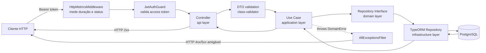
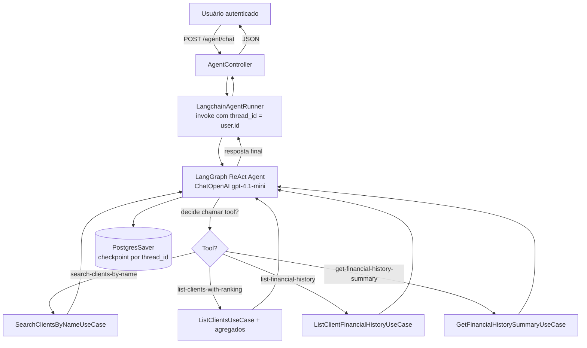
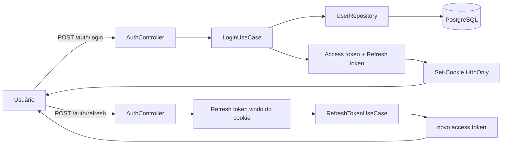
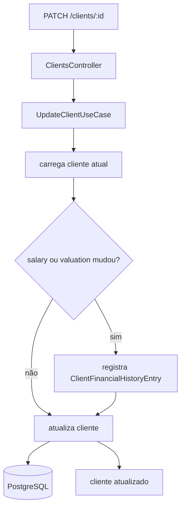
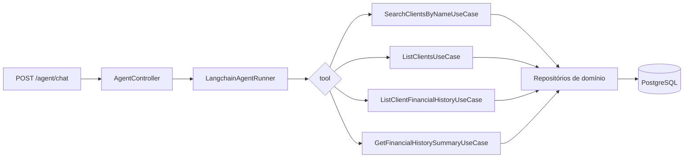

# Back-end (`@teddy-open-finance/back-end`)

API NestJS responsável por autenticação JWT, CRUD de clientes com histórico financeiro, agente conversacional (LangChain + OpenAI) e exposição de métricas Prometheus.

## Stack

- **NestJS 11** — framework HTTP, DI, módulos.
- **TypeORM 0.3** + **PostgreSQL 16** — persistência relacional com migrations versionadas.
- **Passport JWT** — access token (Bearer) + refresh token em cookie `HttpOnly`.
- **LangChain 1.3** + `@langchain/langgraph` + `PostgresSaver` — agente com memória por usuário.
- **Pino** — logs estruturados em JSON.
- **Swagger** — documentação OpenAPI em `/docs`.
- **prom-client** — métricas HTTP + chat em `/metrics`.

## Arquitetura — Clean Architecture por módulo

Cada feature segue a mesma estrutura de 4 camadas, com dependências sempre apontando pra dentro (`api → application → domain`; `infrastructure` implementa interfaces de `domain`):

```text
apps/back-end/src/modules/<feature>/
  domain/            # Entidades puras + interfaces de repositório (sem framework)
  application/       # Use cases (1 classe por caso de uso) + Tools do agente
  infrastructure/    # Implementações TypeORM, LangChain, etc.
  api/               # Controllers + DTOs de entrada/saída
```

Raiz `src/infrastructure/` hospeda infra transversal:

- `config/` — env, database, logger, swagger.
- `http/` — filtros globais (`AllExceptionsFilter`), pipes, guards.
- `metrics/` — `MetricsModule`, middleware Prometheus, registro de counters/histograms.
- `health/` — endpoint `/healthz` (Terminus).

### Fluxograma: lifecycle de um request autenticado



### Módulos de domínio

| Módulo    | Responsabilidade                                                                                                                                                     |
| --------- | -------------------------------------------------------------------------------------------------------------------------------------------------------------------- |
| `auth`    | Login, refresh token via cookie `HttpOnly`, logout, guard JWT global.                                                                                                |
| `users`   | Cadastro e leitura de usuários autenticáveis (seed para login inicial).                                                                                              |
| `clients` | Entidade `Client` com histórico financeiro (`ClientFinancialHistoryEntry`). Use cases de CRUD, listagem paginada, seleção, busca por nome e agregações do histórico. |
| `agent`   | Endpoint `/agent/chat` que injeta use cases de `clients` como **Tools** do LangChain. Sem lógica de domínio própria — apenas orquestra.                              |

### Fluxograma: agente conversacional



Pontos-chave do agente:

- `thread_id` do checkpoint = UUID do usuário autenticado → histórico **sobrevive entre sessões** no back.
- Tools **reutilizam** os use cases de `clients` — zero duplicação de regra de negócio.
- Se `OPENAI_API_KEY` não estiver setado, o módulo registra um runner stub que retorna mensagem amigável de indisponibilidade.
- Métricas específicas: `agent_chat_total{outcome=success|error}` e `agent_chat_duration_seconds`.

## Contratos compartilhados

DTOs de entrada/saída e tipos de domínio expostos ao front ficam em [libs/shared/contracts/](../../libs/shared/contracts/). Isso garante **wire format consistente** entre back e front e elimina divergências de tipagem.

## O que foi pensado na arquitetura do back-end

O back-end precisava resolver quatro frentes sem virar uma base rígida ou acoplada:

- autenticação segura com refresh token
- CRUD de clientes com rastreabilidade financeira
- suporte a um agente de chat sem duplicar regra de negócio
- observabilidade suficiente para operar e depurar em produção

As decisões centrais foram estas:

- **módulos fechados por contexto**: `auth`, `users`, `clients`, `agent`
- **use cases como centro da aplicação**: controllers e tools entram por eles
- **repositórios via interface no domínio**: TypeORM fica isolado em `infrastructure`
- **refresh token em cookie `HttpOnly`**: reduz exposição no front
- **agente como adaptador**: LangChain chama use cases, não SQL nem serviços paralelos
- **logs e métricas como parte do app**: Pino e Prometheus fazem parte do fluxo padrão, não só de produção

### Fluxo: autenticação com refresh token em cookie



### Fluxo: atualização de cliente com histórico financeiro



### Fluxo: como o agente reutiliza o domínio



## Setup local

1. Copie o `.env`:

   ```bash
   cp apps/back-end/.env.example apps/back-end/.env
   ```

2. Postgres acessível (fácil via `docker compose up -d postgres`).

3. Rode:

   ```bash
   npx nx serve back-end
   ```

Endpoints:

- API: `http://localhost:3000`
- Swagger: `http://localhost:3000/docs`
- Health: `http://localhost:3000/healthz`
- Metrics: `http://localhost:3000/metrics`

## Variáveis de ambiente

Tabela completa no [README raiz](../../README.md#back-end-appsback-endenv). Campos críticos: `DATABASE_*`, `JWT_*`, `OPENAI_API_KEY`, `LOG_*`, `DATABASE_RUN_MIGRATIONS`.

## Como o back-end foi organizado para evolução

Alguns pontos foram pensados para evitar retrabalho ao longo do desafio:

- **novos endpoints de clientes** entram no módulo `clients` sem tocar no `agent`
- **novas perguntas do chat** tendem a virar tools finas sobre use cases já existentes
- **novas integrações de observabilidade** entram em `src/infrastructure/metrics` e no logger, sem vazar para o domínio
- **novos consumidores do back** continuam protegidos pelos contratos compartilhados em `libs/shared/contracts`

## Comandos Nx

| Comando                                                | O que faz                                      |
| ------------------------------------------------------ | ---------------------------------------------- |
| `npx nx serve back-end`                                | Hot reload com webpack em dev.                 |
| `npx nx build back-end`                                | Build de produção.                             |
| `npx nx test back-end`                                 | Testes unitários (Jest).                       |
| `npx nx lint back-end`                                 | ESLint.                                        |
| `npx nx typecheck back-end`                            | `tsc --noEmit`.                                |
| `npx nx run back-end-e2e:e2e`                          | E2E da API (Jest + supertest + banco isolado). |
| `npx nx run @teddy-open-finance/back-end:migrate:run`  | Roda migrations TypeORM manualmente.           |
| `npx nx run @teddy-open-finance/back-end:seed:clients` | Popula tabela de clientes com dados fake.      |
| `npx nx run @teddy-open-finance/back-end:seed:users`   | Cria usuário admin para login inicial.         |

## Migrations

Migrations versionadas em [src/infrastructure/config/database/typeorm/migrations/](./src/infrastructure/config/database/typeorm/migrations/). Com `DATABASE_RUN_MIGRATIONS=true`, o boot roda tudo automaticamente. **Nunca use `synchronize: true`** — o projeto trata schema somente via migrations.

## Testes

- **Unitários** (Jest) — rodam contra mocks de repositório, isolando o use case.
- **E2E** (Jest + supertest) — sobem banco Postgres dedicado, rodam migrations, exercitam endpoints reais com autenticação JWT.

Veja [apps/back-end-e2e/](../../apps/back-end-e2e/) para a suíte E2E.

## Observabilidade

O back-end expõe `/metrics` (formato Prometheus) e emite logs JSON via Pino. Dashboards provisionados do Grafana cobrem:

- **Backend Overview** — memória, CPU, heap, event loop, logs.
- **HTTP Traffic** — req/s por rota, p50/p95, 5xx por rota.
- **Agent Activity** — chat rate (success/error), latência, logs LangChain.
- **Postgres Logs** — volume, erros `ERROR/FATAL`, atividade.

Mais detalhes em [README raiz → Observabilidade local](../../README.md#observabilidade-local).

### O que foi instrumentado no agente

Além das métricas, o runner do LangChain emite logs estruturados para o Loki com eventos como:

- `agent_chat_started`
- `agent_chat_finished`
- `agent_chat_failed`
- `langchain_tool_started`
- `langchain_tool_finished`
- `langchain_tool_failed`
- `langchain_chat_model_started`
- `langchain_chat_model_finished`

Isso permite depurar o comportamento do chat sem depender de Langfuse ou LangSmith.

## Padrões de código

- **Sem `else`** — early returns obrigatórios.
- **Sem variáveis genéricas** (`a`, `i`, `x`, `c`) — nomes descritivos.
- **Sem JSDoc/comentários óbvios** — nomes carregam significado.
- Use cases: 1 classe, 1 método público (`execute`), DI via construtor.
- Erros de domínio são classes em `<feature>/domain/errors/` e convertidos em HTTP pelo `AllExceptionsFilter`.

## Leitura recomendada no repositório

- [README raiz](../../README.md)
- [Migrations TypeORM](./src/infrastructure/config/database/typeorm/migrations/)
- [Módulo `clients`](./src/modules/clients/)
- [Módulo `agent`](./src/modules/agent/)
- [Dashboards do Grafana](./observability/grafana/dashboards/)
