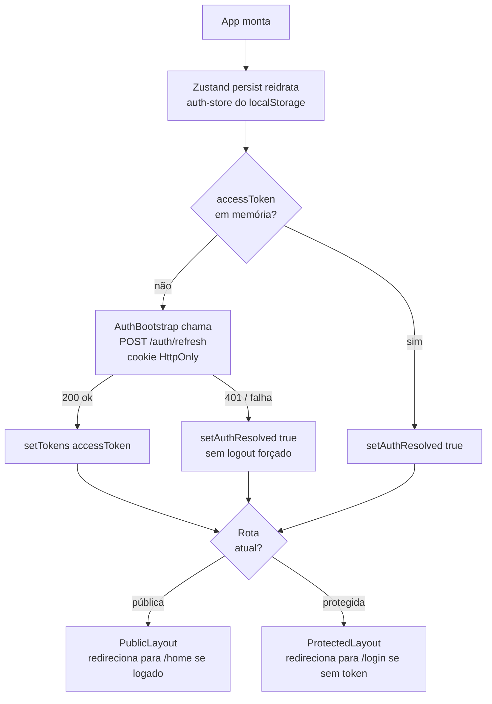
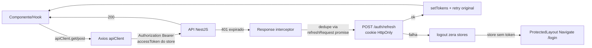
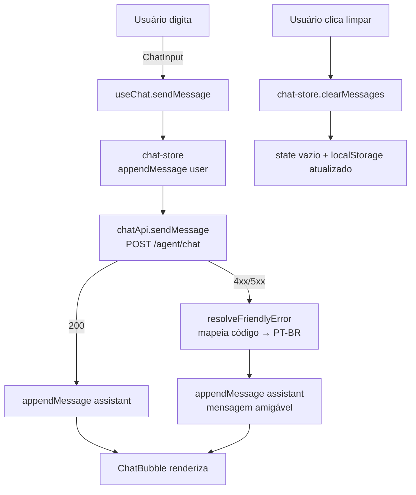
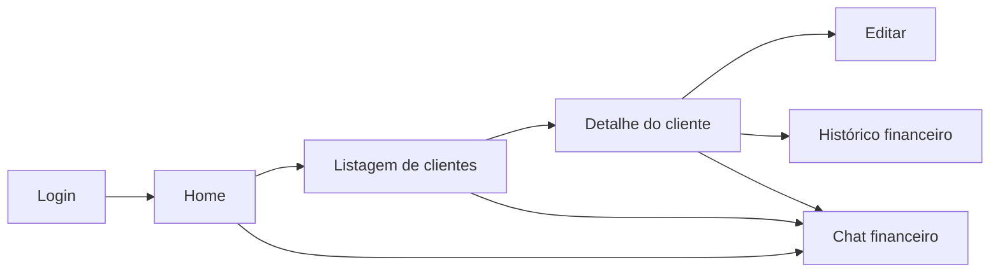
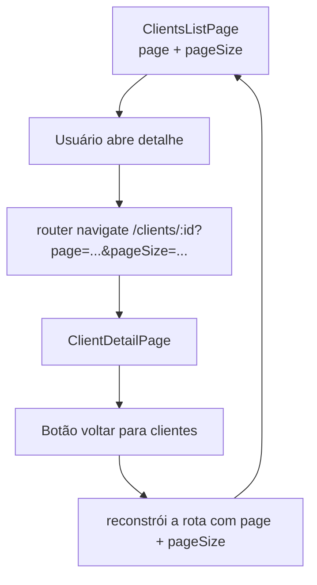
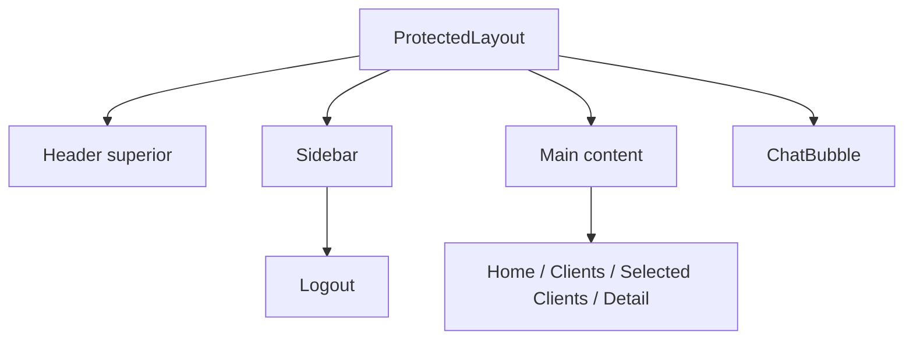
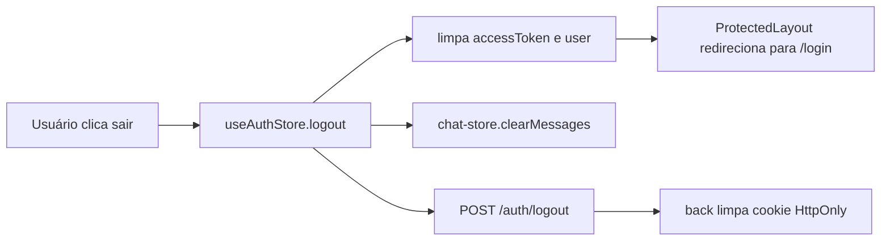
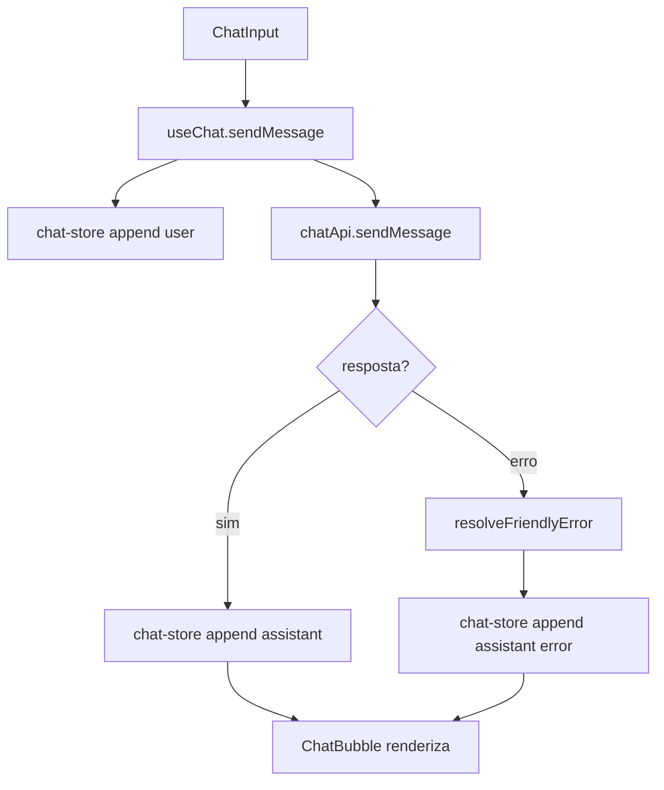

# Front-end (`@teddy-open-finance/front-end`)

SPA React para login e gestão de clientes, com chat financeiro integrado ao agente conversacional do back-end.

## Stack

- **React 19 + Vite + TypeScript** — bundling rápido, HMR e tipagem estrita.
- **React Router 6** — rotas aninhadas, layouts público/privado, guards.
- **React Query** — cache e sincronização de estado de servidor.
- **Zustand** + `persist` middleware — estado de UI e sessão no `localStorage`.
- **Tailwind CSS** — utility-first para estilos (padrão do projeto).
- **Axios** com interceptors para refresh automático de token.
- **Vitest + Testing Library** — testes unitários; Cypress para E2E.

## Arquitetura — feature folders

```text
apps/front-end/src/
  app/
    app.tsx            # Rotas + providers (Router, QueryClient, AuthBootstrap)
    layouts/
      protected-layout.tsx   # Guard de sessão + sidebar + chat bubble
      public-layout.tsx      # Redireciona autenticado para /home
  features/
    auth/              # Login, formulário, hook useLogin
    clients/           # CRUD, listagem paginada, detalhes, histórico
    home/              # Dashboard com métricas e rankings
    chat/              # Bolha de chat conectada ao /agent/chat
  shared/
    api/api-client.ts  # Axios + refresh interceptor
    auth/              # auth-store (Zustand) + auth-bootstrap
    stores/            # Stores globais (selected-clients)
    lib/               # formatters, query-client
    ui/                # Componentes primitivos (Button, Input, Modal, Card...)
```

Regra de dependência: `features/*` podem importar de `shared/*`, mas **não** entre si. Cross-feature se resolve via `shared/` ou store global.

### Fluxograma: autenticação e boot



Pontos-chave:

- `auth-store` persiste **apenas `user`**; `accessToken` fica só em memória, refresh via cookie `HttpOnly` no boot.
- `AuthBootstrap` faz **uma única tentativa** de refresh (`hasAttemptedRefresh` ref) pra evitar loop.
- Refresh falho **não chama `logout()`** — apenas libera o render; `<Navigate>` do router cuida do redirect.
- `logout()` zera auth-store, limpa `chat-store` (`clearMessages`) e bate em `/auth/logout` para invalidar o cookie.

### Fluxograma: requisição autenticada com refresh transparente



Interceptor deduplica refresh simultâneos via uma única `Promise` compartilhada (`refreshRequest`) — N requests em paralelo com 401 disparam **1 refresh**.

### Fluxograma: chat financeiro (bolha integrada)



Pontos-chave do chat:

- `chat-store` usa `persist` em `localStorage` (`teddy-chat`) → histórico **sobrevive a refresh/fechar aba**.
- Erros HTTP são traduzidos em mensagens amigáveis via `resolveFriendlyError` (401/403 → sessão, 429 → rate limit, sem resposta → rede, fallback PT-BR).
- Em produção, `/agent/chat` é rate-limitado pelo **Caddy** (10 req/min/IP).
- Logout limpa `chat-store` e `auth-store` juntos.

## Setup local

1. Copie o `.env`:

   ```bash
   cp apps/front-end/.env.example apps/front-end/.env
   ```

2. Ajuste `VITE_API_URL` (default: `http://localhost:3000`).

3. Rode:

   ```bash
   npx nx serve front-end
   ```

App em `http://localhost:4200`.

## Comandos Nx

| Comando                        | O que faz                                    |
| ------------------------------ | -------------------------------------------- |
| `npx nx serve front-end`       | Vite com HMR.                                |
| `npx nx build front-end`       | Build de produção (Vite).                    |
| `npx nx test front-end`        | Testes unitários (Vitest + Testing Library). |
| `npx nx lint front-end`        | ESLint.                                      |
| `npx nx typecheck front-end`   | `tsc --noEmit`.                              |
| `npx nx run front-end-e2e:e2e` | E2E com Cypress.                             |

## Fluxos de produto

- **Login/autenticação** — form com validação, persistência de sessão via cookie `HttpOnly` + `accessToken` em memória.
- **Home/Dashboard** — métricas, rankings e atalhos.
- **Clientes** — listagem paginada, criar/editar/excluir (modais), detalhes, histórico financeiro.
- **Seleção de clientes** — store global para marcar/limpar selecionados.
- **Chat financeiro** — bolha flutuante disponível em toda área autenticada, com persistência do histórico por usuário.

## O que foi pensado na arquitetura do front-end

O front-end precisava sustentar uma experiência de operação contínua, não só renderizar páginas isoladas. Por isso, a organização foi guiada por quatro objetivos:

- manter o fluxo autenticado estável mesmo com refresh de página
- separar claramente estado de servidor, estado de sessão e estado de interface
- permitir evolução por feature sem criar acoplamento lateral entre módulos
- encaixar o chat como parte da navegação principal, e não como experimento isolado

As decisões mais relevantes foram estas:

- **feature folders** para manter escopo local de cada fluxo
- **React Query** para tudo que vem do back e precisa de cache/refetch
- **Zustand** para sessão, chat e seleção de clientes
- **layout público e layout protegido** para centralizar guardas e shell visual
- **chat dentro do `ProtectedLayout`** para acompanhar toda a área autenticada
- **refresh token fora do front**: o cookie `HttpOnly` fica no back/browser, e o front só trabalha com o `accessToken` em memória

### Fluxo: navegação principal do usuário



### Fluxo: listagem → detalhe → retorno preservando contexto



### Fluxo: composição visual da área autenticada



### Fluxo: logout e limpeza de sessão



## Como as responsabilidades foram separadas

| Camada / pasta     | Responsabilidade                                       |
| ------------------ | ------------------------------------------------------ |
| `app/`             | providers, router e layouts globais                    |
| `features/auth`    | login, formulário e chamada de autenticação            |
| `features/clients` | CRUD, detalhe, histórico e listagem                    |
| `features/home`    | dashboard e rankings                                   |
| `features/chat`    | bolha, input, mensagens e integração com `/agent/chat` |
| `shared/api`       | cliente HTTP, interceptors e refresh transparente      |
| `shared/auth`      | bootstrap e store de autenticação                      |
| `shared/stores`    | estados globais não acoplados a uma única feature      |
| `shared/lib`       | formatadores e utilidades reutilizáveis                |
| `shared/ui`        | primitives visuais reutilizáveis                       |

## Como o chat foi integrado ao front-end

O chat não foi implementado como uma tela separada. Ele faz parte da experiência principal do app:

- fica disponível em toda a área autenticada
- persiste mensagens entre refreshes
- limpa o histórico no logout
- traduz falhas técnicas em mensagens operacionais compreensíveis

### O que isso resolve

- permite perguntar sobre a base sem sair do contexto de trabalho
- reduz a necessidade de navegar manualmente entre Home, listagem e detalhe para perguntas simples
- mantém coerência com o restante do produto, porque a fonte de dados é a mesma API usada pelas páginas

### Fluxo do chat no front



## Padrões de código

- **Tailwind utility classes** em vez de CSS modules.
- **Sem `else`** — early returns.
- **Sem nomes genéricos** (`a`, `i`, `x`, `c`).
- **Sem JSDoc/comentários óbvios** — nomes descritivos.
- Feature folders com `api/`, `components/`, `hooks/`, `pages/`, `store/` conforme necessidade.
- Cross-feature communication **apenas** via `shared/stores` ou `shared/api`.

## Leitura recomendada no repositório

- [README raiz](../../README.md)
- [Layout protegido](./src/app/layouts/protected-layout.tsx)
- [Auth store](./src/shared/auth/auth-store.ts)
- [Auth bootstrap](./src/shared/auth/auth-bootstrap.tsx)
- [Chat feature](./src/features/chat/)
- [Clients feature](./src/features/clients/)
